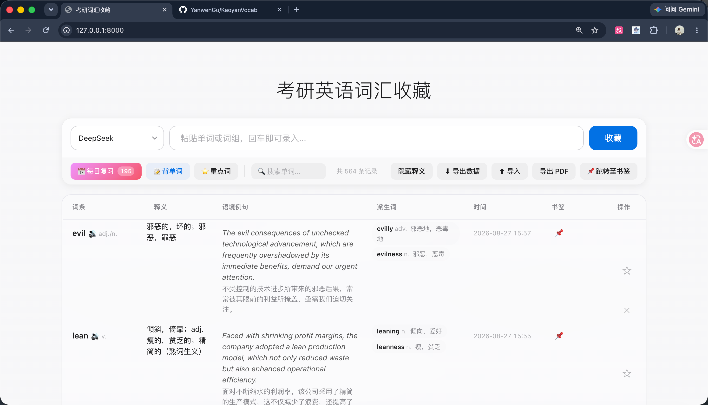

# KaoyanVocab · 考研英语词汇自动化收集系统

> A minimalist vocabulary collection system for Chinese graduate entrance exam (考研) preparation.

做真题时复制生词 → 粘贴到网页（或浏览器右键划词）→ AI 自动补全释义、例句、派生词 → 存入本地 SQLite → 背单词 / 每日复习 → 周末导出 PDF 打印背诵。



## 功能

- **AI 词条补全** — DeepSeek / MiMo 自动补全词性、释义、中英文例句、派生词，并自动做**词形还原**（`running → run`，词组保留原形如 `take it for granted`）
- **拼写纠错** — 回车录入自动检查拼写，打错字母弹出建议窗口
- **浏览器右键划词** — Chrome 扩展，在任意网页选中生词右键即可收藏，实时同步当前翻译来源
- **背单词** — 全屏卡片式背诵（认识 Q / 不认识 E / 空格下一张 / R 返回），不认识自动标记为重点
- **书签续背** — 退出背单词时书签自动保存到下一个单词的位置，下次打开直接从书签继续
- **每日复习** — SM-2 间隔重复算法，自适应每日 100–300 词，重点词优先
- **重点标记 / 搜索 / 行内编辑** — ⭐ 重点词、中英文模糊搜索、双击单元格直接编辑
- **PDF 导出** — Cmd+P 一键打印，排版已适配 A4（周末打印背诵）

## 快速开始

```bash
# 1. 安装依赖
pip install -r requirements.txt

# 2. 配置 API Key（编辑 .env，格式见下）

# 3. 启动后端（同时托管前端页面）
python main.py
open http://127.0.0.1:8000

# 或使用一键脚本（杀掉旧进程 → 后台启动 → 打开浏览器）：
bash restart.sh
```

## .env 配置

```
DEEPSEEK_API_KEY=sk-xxx
DEEPSEEK_BASE_URL=https://api.deepseek.com        # 可选，默认此地址
MIMO_API_KEY=sk-xxx                                # 可选：小米 MiMo（OpenAI 兼容）
MIMO_BASE_URL=https://api.xiaomimimo.com           # 可选
MIMO_MODEL=mimo-v2.5                               # 可选
```

> `.env` 已被 gitignore，请勿提交。

## 使用方式

- **录入单词**：复制单词，粘贴到输入框，按回车 → AI 自动补全词条
- **录入词组**：粘贴词组（如 `take it for granted`），点「收藏」按钮直接录入（跳过拼写检查）
- **右键划词**：`chrome://extensions` → 开启开发者模式 → 加载 `browser-extension/` 文件夹
- **翻译来源**：页面上方可切换 DeepSeek / MiMo 快速 / MiMo 深度思考，浏览器扩展自动跟随
- **导出 PDF**：点「导出PDF」→ Cmd+P → 保存为 PDF → 打印

## 技术栈

| 层 | 技术 |
|----|------|
| 后端 | Python + FastAPI + Uvicorn |
| 数据库 | SQLite（单文件，零配置） |
| AI 引擎 | DeepSeek API + 小米 MiMo（OpenAI 兼容，可切换） |
| 前端 | 纯 HTML + Vanilla JS + CSS（无框架、无构建） |
| 扩展 | Chrome Manifest V3 |
| PDF 导出 | CSS @media print + 浏览器原生打印 |

## 项目结构

```
├── main.py               # FastAPI 后端（API + 托管前端 + SQLite）
├── index.html            # 纯 HTML/JS/CSS 前端（无构建工具）
├── browser-extension/    # Chrome 右键划词扩展
├── restart.sh            # 一键重启脚本
└── requirements.txt
```

## 隐私说明

所有词汇数据保存在本地 `vocab_data.db`（SQLite 单文件），只有调用 AI 补全词条时才把单词发送给所选 API 服务商。
